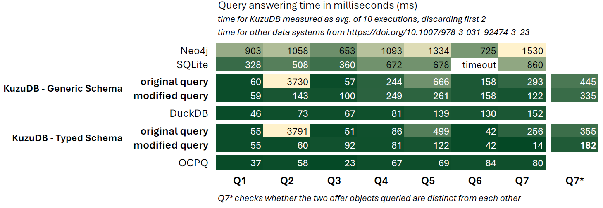

# Data Model and Queries for Building and Analyzing Object-Centric Event Data as Event Knowledge Graphs using KuzuDB

This project provides a
* Data model and generic query templates for translating and integrating a set of related CSV event logs into a single event knowledge (EKG), stored as labeled property graph in KuzuDB
* example queries for various multi-dimensional process mining and object-centric process mining use cases
  * [Object-Centric Process Quering](#object-centric-process-querying)

Copyright (C) 2019-2025
Stefan Esser, INFORM GmbH, Aachen, Germany and Eindhoven University of Technology, Eindhoven, the Netherlands
Dirk Fahland, Eindhoven University of Technology, Eindhoven, the Netherlands

## Supporting Publications

Esser, Stefan and Dirk Fahland. "Multi-Dimensional Event Data in Graph Databases." (2021)
Journal on Data Semantics. DOI: 10.1007/s13740-021-00122-1
arXiv pre-print: https://arxiv.org/pdf/2005.14552.pdf

# Set Up

## Requirements

* Install Python/Anaconda
* Install kuzudb (in-memory graph database as a Python package)
    * `pip install kuzudb`

Database creation and launching is fully managed by the Python scripts, no other setup or configuration is required.

## Data

* the scrips assume the data from 
   * Esser, Stefan, & Fahland, Dirk. Event Data and Queries for Multi-Dimensional Event Data in the Neo4j Graph Database (Version 1.0) [Data set]. Zenodo: http://doi.org/10.5281/zenodo.3865222  (2020)
   * extract the file contents into this project directory, each dataset will be extracted into its own `/.BPICXX/` directory

# Building EKGs using KuzuDB 

## Scripts provided

* `bpicXX_prepare.py` - scripts that normalizes the original CSV data to an event table in CSV format required for the import and stores the output in the directory `./prepared/`
* `bpicXX_import_csv_to_kuzu_db.py` - script to let KuzuDB read the normalized event table of BPICXX from CSV files in `./prepared/` and executes several data modeling queries to construct an event knowledge graph using 
    * node types :Event, :Log, :Entity
    * relationship types:
        * :HAS (Log to Event, events recorded in a log),
        * :CORR (Event to Entity, describing to which entities an event is correlated), 
        * :REL (Entity to Entity, which entities are structurally related)
    * invokes `infer_df_edges.py` to infer :DF relations between :Event nodes (see below)
    * invokes `queries_build_dfg.py` to aggregate EKG into a multi-entity directly-follows graph by adding :Class nodes and :DF_C edges (see below)
* `infer_df_edges.py` - generic inference of directly-follows relationships between all :Event nodes related (:CORR) to the same :Entity node, constructs :DF relationship (directly-follows of events: temporal ordering of event nodes per corelated entity)
* `queries_build_dfg.py` - generic inference of multi-entity directly-follows graph for existing EKG by adding
    * node type :Class (event classes representing sets of events, e.g., by their activity property)
    * relationship types
        * :OBSERVED (Event to Event Class, which class of events was observed when the event occurred,  e.g., which activity)
        * :DF_C (aggregated directly-follows relation between class nodes)

* `..._typed.py` - variants of scripts for importing CSV as EKG in KuzuDB as strictly types nodes and relations, e.g., using node label :Application instead of :Entity node with property EntityType="Application"
* various `bpic17_queries_XXX.py` scripts for various analysis tasks

## How to use

For data import

1. extract data into `./BPICXX/` directory
2. run bpicXX_prepare.py
3. run bpicXX_import....py
4. run any of the `bpicXX_queries_....py.` scripts

# Analysis Examples

## Object-Centric Process Querying

Perform Object-Centric Process Querying on BPIC'17 as defined in: Küsters, A., van der Aalst, W.M.P. (2025). OCPQ: Object-Centric Process Querying and Constraints. https://doi.org/10.1007/978-3-031-92474-3_23

### Scripts to execute:

* OCPQ against general schema
    * run `bpic17_import_csv_to_kuzu_db.py`
    * run `bpic17_queries_ocpq_kuzu_db.py`

* OCPQ against strongly typed schema
    * run `bpic17_import_csv_to_kuzu_db_typed.py`
    * run `bpic17_queries_ocpq_kuzu_db_typed].py`

The scripts run all 7 of the OCPQ queries used in the paper against kuzudb and measure execution times. For each query, several variants are implemented and compared. Detailed results are listed in `results_bpic17_queries_ocpq_kuzu_db[_typed].txt`

### OCPQ Results

Executing the queries yields the following execution times comapred to other OCPQ approaches

We can see that OCPQ using Kuzu DB - an off-the-shelf general purpose graph data management system
* is significantly faster than Neo4j while reusing the same general and easily readble Cypher queries
* using a strictly typed schema reaches performance faster than DuckDB and on some cases on par with the optimized OCPQ apprach of https://doi.org/10.1007/978-3-031-92474-3_23